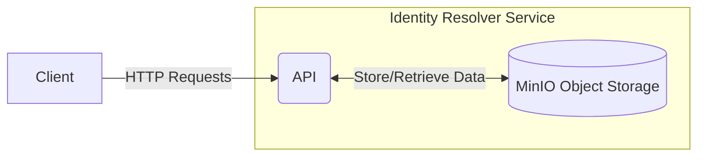

# Identity Resolver

The Pyx Identity Resolver is a system designed to manage and resolve links associated with various identifiers, such as GTINs (Global Trade Item Numbers).
It provides a flexible solution for identity registry operators or identifier owners to register and manage links to more information about a product.
This system enables value chain actors to resolve and access this information across different identifier schemes. 
As a result, it enhances traceability and data accessibility throughout the supply chain.

## Quick Start

To get the Identity Resolver up and running quickly, follow these steps:

1. Clone the repository:
   ```bash
   git clone https://github.com/pyx-industries/pyx-identity-resolver.git
   cd pyx-identity-resolver/app
   ```

2. Create the environment file:
   ```bash
   cp .env.development.local.example .env.development.local
   ```

3. Start the application using Docker Compose:
   ```bash
   docker-compose up -d
   ```

4. Access the API documentation at [http://localhost:3000/api](http://localhost:3000/api)

For more detailed setup and configuration options, refer to the sections below.

---

## Table of Contents
1. [Architecture](#architecture)
2. [Installation](#installation)
3. [Configuration](#configuration)
   - [Environment Variables](#environment-variables)
   - [MinIO Configuration](#minio-configuration)
4. [Running the App](#running-the-app)
5. [Development with Docker Compose](#development-with-docker-compose)
6. [API Documentation](#api-documentation)
7. [Testing](#testing)
   - [Unit Tests](#unit-tests)
   - [E2E Tests](#e2e-tests)
8. [Contributing](#contributing)

---

## Architecture


### API Role
The API serves as the central interface for the Identity Resolver service.
It handles incoming HTTP requests from clients, processes them, and interacts with MinIO object storage to fulfill these requests.
The API is responsible for operations such as registering and resolving links, managing identifier schemes, and handling user authentication.

### MinIO Role
MinIO is the primary data store for the Identity Resolver service. 
It's an object storage solution used to store and manage all the data required by the system, including identifier information, link data, and associated metadata. 
The API interacts directly with MinIO to perform all data operations, eliminating the need for a separate database.

## Installation

### Prerequisites

- [Node.js](https://nodejs.org/en/) version 22.0.0
- Docker and Docker Compose (for quick start and local development)

To install the application dependencies, run:

```bash
npm install
```

## Configuration

### Environment Variables

Create a `.env.development.local` file in the `app` directory of the project by copying the example file:

```bash
cp .env.development.local.example .env.development.local
```

### MinIO Configuration

The Identity Resolver service uses MinIO as its primary data store.
The Docker Compose configuration allows for flexible and persistent data storage across different operating systems.

#### Configuration Details

In the `docker-compose.yml` file, MinIO's data storage is configured as follows:

```yaml
volumes:
  - ${MINIO_DATA_DIR:-./minio_data}:/data
```

This configuration uses an environment variable `MINIO_DATA_DIR` if set, otherwise defaulting to `./minio_data` in the current directory.

To persist MinIO storage outside of the cloned repository, set the `MINIO_DATA_DIR` environment variable before running Docker Compose:

- Unix-based systems (Linux, macOS):
  ```bash
  export MINIO_DATA_DIR=~/minio/idr/data
  docker-compose up -d
  ```

- Windows (PowerShell):
  ```powershell
  $env:MINIO_DATA_DIR = "$HOME\minio\idr\data"
  docker-compose up -d
  ```

- Windows (Command Prompt):
  ```cmd
  set MINIO_DATA_DIR=%USERPROFILE%\minio\idr\data
  docker-compose up -d
  ```

## Running the App

```bash
# Start MinIO container
docker-compose up -d minio

# Development mode
npm run start

# Watch mode
npm run start:dev

# Production mode
npm run start:prod
```

## Development with Docker Compose

When using Docker Compose for development, keep the following points in mind:

1. Changes to the application code will not be reflected in the running container automatically.
   To see your changes, you need to rebuild and restart the container:
   ```bash
   docker-compose up -d --build
   ```

2. For a more dynamic development experience, you can use the watch mode while keeping the MinIO container running:
   ```bash
   # Start MinIO container
   docker-compose up -d minio
   
   # Run the app in watch mode
   npm run start:dev
   ```
   This approach allows you to see your changes immediately without rebuilding the container.

3. Remember that any changes to environment variables or Docker-related configurations will require a rebuild of the container.

## API Documentation

For detailed information about our API endpoints, request/response formats, and authentication methods, please refer to our API documentation:
[http://localhost:3000/api](http://localhost:3000/api)

## Testing

### Unit Tests

```bash
# Run unit tests
npm run test

# Generate test coverage report
npm run test:cov
```

### E2E Tests

Prerequisites for running E2E tests locally:

1. Create a `.env.test.local` file in the `app` directory of the project.
   Use the `.env.test.local.example` file as a template:

```bash
cp .env.test.local.example .env.test.local
```

2. Update the docker-compose.yaml file to use the correct environment variables for the test environment.

```yaml
environment:
  - NODE_ENV=test
  - MINIO_BUCKET_NAME=idr-bucket-test
```

3. Start the application in test mode:
   ```bash
   docker-compose up -d --build
   ```

Then run the E2E tests:

```bash
npm run test:e2e
```

## Contributing

We use [Semantic Line Breaks](https://sembr.org/) in our documentation.
Please follow this convention when contributing to the project's documentation.